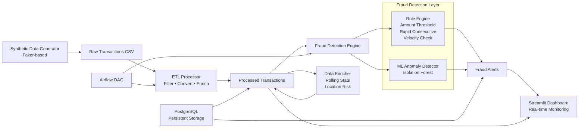

# VPBank Fraud Detection Pipeline

Production-grade fraud detection platform for VPBank — processing banking transaction data through an end-to-end pipeline with real-time monitoring, ML-based anomaly detection, and compliance-ready alerting.

## Architecture



## Pipeline Stages

| Stage | Component | Description |
|-------|-----------|-------------|
| **1. Data Generation** | `src/data_generator.py` | Synthetic transaction generator with realistic distribution patterns (amounts weighted 10–200K VND) |
| **2. ETL Processing** | `src/etl/processor.py` | Extract, transform, load — filters completed txs, currency conversion, temporal features |
| **3. Data Enrichment** | `src/etl/enricher.py` | Rolling window statistics, location risk scoring, account velocity analysis |
| **4. Fraud Detection** | `src/fraud/detector.py` | Multi-layered detection: rule engine + Isolation Forest anomaly detection |
| **5. Monitoring** | `src/monitoring/dashboard.py` | Streamlit dashboard with real-time metrics, alert visualization, data quality KPIs |

## Tech Stack

| Layer | Technology |
|-------|-----------|
| **Language** | Python 3.11+ |
| **Data Processing** | Pandas, NumPy, scikit-learn |
| **Orchestration** | Apache Airflow 2.8+ |
| **Monitoring** | Streamlit, Plotly |
| **Storage** | PostgreSQL, CSV |
| **Configuration** | Pydantic, YAML |
| **Logging** | Structlog (JSON output) |
| **CLI** | Click |
| **Containerization** | Docker, Docker Compose |

## Quick Start

```bash
# 1. Install dependencies
pip install -e ".[dev]"

# 2. Generate synthetic transaction data
vpbank-pipeline generate 10000

# 3. Run ETL pipeline
vpbank-pipeline etl

# 4. Run fraud detection
vpbank-pipeline detect

# 5. Or run the complete pipeline end-to-end
vpbank-pipeline run-all --num-records 10000

# 6. Launch monitoring dashboard
streamlit run src/monitoring/dashboard.py
```

## Repository Structure

```
vpbank-fraud-detection-pipeline/
├── src/
│   ├── config/              # Configuration management (pydantic-settings)
│   ├── etl/                 # ETL processing layer
│   │   ├── processor.py     # Core ETL pipeline
│   │   └── enricher.py      # Data enrichment features
│   ├── fraud/               # Fraud detection engine
│   │   ├── detector.py      # Multi-layered detector (rules + ML)
│   │   └── rules.py         # Configurable rule engine
│   ├── models/              # Pydantic domain models
│   ├── monitoring/          # Streamlit dashboard
│   ├── data_generator.py    # Synthetic data generation
│   ├── logger.py            # Structured logging
│   └── main.py              # CLI entry point
├── dags/                    # Airflow DAG definitions
├── db/                      # Database schema
├── data/                    # Sample transaction data
├── tests/                   # Unit and integration tests
├── notebooks/               # Exploration notebooks
├── docker-compose.yml       # Docker services
├── pyproject.toml            # Project configuration
└── README.md                # This file
```

## CLI Commands

| Command | Description |
|---------|-------------|
| `vpbank-pipeline generate <n>` | Generate n synthetic transactions |
| `vpbank-pipeline etl` | Run ETL processing pipeline |
| `vpbank-pipeline detect` | Execute fraud detection engine |
| `vpbank-pipeline dashboard` | Launch monitoring dashboard |
| `vpbank-pipeline run-all` | Run complete pipeline end-to-end |

## Fraud Detection Rules

| Rule | Type | Description | Default Threshold |
|------|------|-------------|-------------------|
| High Value Transaction | Amount Threshold | Flags transactions exceeding configured limit | $10,000 |
| Rapid Consecutive Tx | Velocity Check | Detects multiple fast transactions from same account | 3 in 5 min |
| High Velocity Account | Velocity Check | Flags accounts with unusual transaction frequency | 10/hour |
| ML Anomaly Detection | Isolation Forest | Unsupervised anomaly detection on amount + temporal features | 1% contamination |

## Data Quality

- **Input validation**: Pydantic models enforce schema and constraints
- **ETL filtering**: Only completed transactions processed
- **Null handling**: Comprehensive null checks across pipeline
- **Logging**: JSON-structured logs for observability
- **Monitoring**: Dashboard with data quality KPIs

## Deployment

### Docker
```bash
docker-compose up -d
```

### Airflow
```bash
# Initialize Airflow
airflow db init
# Copy DAG to Airflow DAGs folder
cp dags/etl_dag.py $AIRFLOW_HOME/dags/
```

## License

MIT — See LICENSE for details.

---

*Built by Will Tran — Senior Data Engineer*