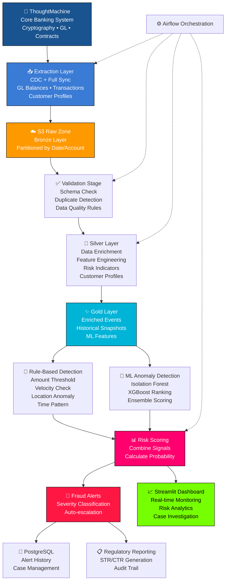

# Vietnam Banking Fraud Detection & Risk Intelligence Platform

Enterprise-grade fraud detection and risk intelligence system integrating ThoughtMachine Core Banking with cryptographic general ledger models for real-time transaction monitoring, anomaly detection, and regulatory compliance.

## Architecture



## Data Pipeline Stages

| Stage | Component | Data Source | Description |
|-------|-----------|-------------|-------------|
| **1. Extraction** | `src/integrations/thoughtmachine_extractor.py` | ThoughtMachine GL API | CDC + Full sync of GL balances, transactions, contracts |
| **2. S3 Staging** | `src/jobs/bronze_ingest.py` | AWS S3 Raw | Partition by date/account ID, Parquet format |
| **3. Validation** | `src/etl/validator.py` | Bronze Zone | Schema validation, duplicate detection, data quality checks |
| **4. Transformation** | `src/jobs/silver_transform.py` | Silver Zone | Feature engineering, risk indicators, customer enrichment |
| **5. Gold Layer** | `src/jobs/gold_kpi.py` | Gold Zone | ML-ready features, historical snapshots, aggregations |
| **6. Risk Scoring** | `src/fraud/detector.py` | Gold Zone | Rule-based + ML anomaly scoring |
| **7. Alerting** | `src/fraud/rules.py` | PostgreSQL | Fraud classification, escalation, regulatory flags |
| **8. Reporting** | `src/monitoring/dashboard.py` | Streamlit | Real-time dashboards, case investigation, compliance reports |

## Tech Stack

| Layer | Technology |
|-------|-----------|
| **Source System** | ThoughtMachine Core Banking (GL + Contracts) |
| **Data Lake** | AWS S3 (Bronze/Silver/Gold) + Redshift/RDS |
| **Language** | Python 3.10+ (Async, Multiprocessing) |
| **Data Processing** | PySpark, Pandas, DuckDB |
| **ML/Fraud Detection** | Scikit-learn, XGBoost, Isolation Forest |
| **Orchestration** | Apache Airflow 2.7+ |
| **Monitoring** | Streamlit, Plotly, Prometheus |
| **Logging** | Structlog (JSON), CloudWatch |
| **Configuration** | Pydantic, .env |
| **CLI** | Click with multi-command interface |
| **Containerization** | Docker, Docker Compose, Kubernetes |
| **CI/CD** | GitHub Actions (lint, test, deploy) |

## Quick Start

```bash
# 1. Install dependencies
pip install -r requirements.txt

# 2. Configure ThoughtMachine connection
cp .env.example .env
# Edit .env: TM_API_URL, TM_API_KEY, AWS credentials

# 3. Run extraction pipeline (ThoughtMachine → S3)
python -m src.jobs.bronze_ingest --date 2024-05-13 --incremental

# 4. Run transformation (Silver/Gold layers)
python -m src.jobs.silver_transform
python -m src.jobs.gold_kpi

# 5. Run fraud detection
python -m src.fraud.detector

# 6. Or use Airflow DAG
airflow dags trigger banking_fraud_detection_pipeline

# 7. Launch dashboards
streamlit run src/monitoring/dashboard.py
```

## Data Models

### ThoughtMachine GL Integration

**Source**: ThoughtMachine Core Banking (Cryptographic General Ledger)

```
GL Structure:
├── Ledger (Account Balance)
│   ├── Posting Instructions (Transactions)
│   ├── Contracts (Products)
│   └── Customer (Account Holder)
├── Vault (Encrypted Secrets)
└── Calendar (Business Days)
```

**Extracted Tables** (S3 Parquet):
- `gl_balances` — Account balances per posting instruction
- `gl_transactions` — Posting instruction details with GL accounts
- `gl_contracts` — Product contracts linked to customers
- `gl_customers` — Customer master data

## Repository Structure

```
vnbank-fraud-detection-platform/
├── src/
│   ├── config/              # Configuration management (pydantic-settings)
│   ├── etl/                 # ETL processing layer
│   │   ├── processor.py     # Core ETL pipeline
│   │   └── enricher.py      # Data enrichment features
│   ├── fraud/               # Fraud detection engine
│   │   ├── detector.py      # Multi-layered detector (rules + ML)
│   │   └── rules.py         # Configurable rule engine
│   ├── models/              # Pydantic domain models
│   ├── monitoring/          # Streamlit dashboard
│   ├── data_generator.py    # Synthetic data generation
│   ├── logger.py            # Structured logging
│   └── main.py              # CLI entry point
├── dags/                    # Airflow DAG definitions
├── db/                      # Database schema
├── data/                    # Sample transaction data
├── tests/                   # Unit and integration tests
├── notebooks/               # Exploration notebooks
├── docker-compose.yml       # Docker services
├── pyproject.toml            # Project configuration
└── README.md                # This file
```

## CLI Commands

| Command | Description |
|---------|-------------|
| `vnbank-pipeline generate <n>` | Generate n synthetic transactions |
| `vnbank-pipeline etl` | Run ETL processing pipeline |
| `vnbank-pipeline detect` | Execute fraud detection engine |
| `vnbank-pipeline dashboard` | Launch monitoring dashboard |
| `vnbank-pipeline run-all` | Run complete pipeline end-to-end |

## Fraud Detection Rules

| Rule | Type | Description | Default Threshold |
|------|------|-------------|-------------------|
| High Value Transaction | Amount Threshold | Flags transactions exceeding configured limit | $10,000 |
| Rapid Consecutive Tx | Velocity Check | Detects multiple fast transactions from same account | 3 in 5 min |
| High Velocity Account | Velocity Check | Flags accounts with unusual transaction frequency | 10/hour |
| ML Anomaly Detection | Isolation Forest | Unsupervised anomaly detection on amount + temporal features | 1% contamination |

## Data Quality

- **Input validation**: Pydantic models enforce schema and constraints
- **ETL filtering**: Only completed transactions processed
- **Null handling**: Comprehensive null checks across pipeline
- **Logging**: JSON-structured logs for observability
- **Monitoring**: Dashboard with data quality KPIs

## Deployment

### Docker
```bash
docker-compose up -d
```

### Airflow
```bash
# Initialize Airflow
airflow db init
# Copy DAG to Airflow DAGs folder
cp dags/etl_dag.py $AIRFLOW_HOME/dags/
```

## License

MIT — See LICENSE for details.

---

*Built by Will Tran — Senior Data Engineer*